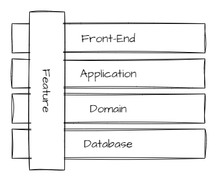
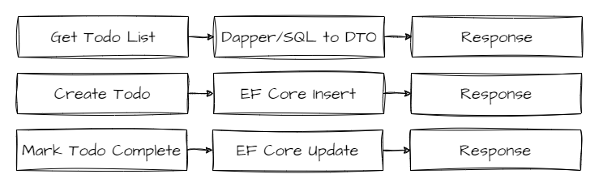

# TodoApi
This project is an example solution template of an ASP.NET Core HTTP API that organizes code by capability (vertical slice architecture).

## Purpose
Often in codebases when creating a feature or changing an existing one, there's a need to change many different projects, files, and layers through out the system.  

In this project, code is organized by feature, rather than layers. Each feature (request) within the system is built around a distinct use case, meaning a single feature groups and encapsulates all of its concerns within a single "vertical slice."  

Using this approach, we avoid making changes across horizontal layers and rather only touch the feature we're interested in. We avoid "shared layer" abstractions such as repositories, services, etc. that require we make changes that affect more than just the feature we're presently working on. New features mean only adding code, rather than making changes to shared code and worrying about cascading side effects.



Because each feature is organized this way, each feature in the system can decide for itself how to best fulfill a request.



Using this approach, we'll find that we *minimize* coupling *between* features, but *maximize* the coupling *within* a feature. Sharing code becomes a purposeful decision instead of the default. You may also find that this simplifies project structure. For example, with a simple API, we may only need to create a single .NET project or assembly and separate things out by folder structure and namespace, as opposed to creating a .NET project per horizontal layer.

## Technologies showcased
* ASP.NET Core Web API w/ Swagger documentation
* Vertical slice architecture
* Entity Framework Core (SQL Server)
* FluentValidation
* Integration tests using xUnit

## Getting started
To work with this project, you need:
* .NET 8+ SDK
* PowerShell (version 7+ is recommended in cross-platform scenarios)

### How to run
To run the project, you can set the `TodoApi` as your start-up project in Visual Studio 2022 17.8+ and go, or use the `dotnet` CLI:
```
dotnet run src/TodoApi/TodoApi.csproj
```

### How to test
To run all the tests, use the Text Explorer within Visual Studio 2022 17.8+ or the `dotnet` CLI:
```
dotnet test
```

You may alternatively run the build script, `build.ps1`, which runs all the tests by default.

Currently, there's one test project, `TodoApi.Tests`, where all the integration tests live. Integration tests are preferred as they will typically execute vertical slices or features against each other just as users would, mimicking the production scenarios very closely as the tests use actual dependency injection (DI) registrations, pipeline configuration, validation, real SQL Server DDL/DML, and so on.  

This project may also contain unit tests for testing at a more granular level, if desired.

### Build process
This project makes use of a single build script, `build.ps1`. The build script takes care of all the tasks related to continuous integration, such as:
* Cleaning previous binaries
* Verifying code analysis rules, code style
* Building
* Running integration tests
* Creating deployment artifact(s)

## Database migrations
This project makes use of EF Core's code-first migrations. Migrations are applied automatically for local development. There's no need to `Update-Database` or similar in most cases.

### Scaffolding new migration
```
dotnet ef migrations add InitialCreate --project ./src/TodoApi/TodoApi.csproj
```

### Manually apply migrations
```
dotnet ef database update --project ./src/TodoApi/TodoApi.csproj
```

### References
Inspired by:
1. [Vertical Slice Architecture by Jimmy Bogard](https://www.jimmybogard.com/vertical-slice-architecture/)
2. [ContosoUniversityDotNetCore-Pages](https://github.com/jbogard/ContosoUniversityDotNetCore-Pages)
